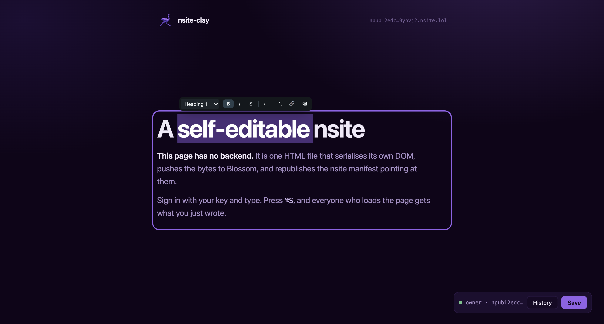

<p align="center">
  
</p>

<h1 align="center">nsite-clay</h1>

<p align="center">
  A self-editable nsite.<br>
  One HTML file that edits and republishes itself, hosted on Nostr.
</p>

<p align="center">
  <a href="https://npub12edc7326qsryw5rw5yw0yh57fmj9r8jf4c8xazz6333w305qgnms9ypvj2.nsite.lol/"><b>Homepage</b></a>
  ·
  <a href="https://npub16kwfcualkq4kz6vgs8tze0j4jkpgs53h48ghmpnj80s7cvfjspwsh4uk9u.nsite.lol/">Live demo</a>
  ·
  <a href="docs/RUNTIME-API.md">Runtime reference</a>
</p>

<p align="center"><sub>The homepage is itself an nsite-clay document, and it edits itself.</sub></p>

<p align="center">
  
</p>

---

Open the page, sign in with your key, and type into it. The document serialises its own DOM,
pushes those bytes to a [Blossom](https://github.com/hzrd149/blossom) server as one
content-addressed blob, and republishes the [NIP-5A](https://github.com/nostr-protocol/nips/blob/master/5A.md)
nsite manifest that points at it. Anyone else loading the page gets a plain static document with
your changes already in it.

Nothing in that loop is a server you have to run. Relays hold the manifest, Blossom servers hold
the bytes, and the browser does the rest. Ownership is a keypair rather than an account, so
"who may edit this page" is not a row in somebody else's database.

The idea is [HyperClay](https://hyperclay.com)'s and the editing model follows
[ClayJS](https://clayjs.com); this is that model with Nostr underneath instead of a hosting
platform.

## Try it

A live document is published under a throwaway key, and the key is public on purpose:

**<https://npub16kwfcualkq4kz6vgs8tze0j4jkpgs53h48ghmpnj80s7cvfjspwsh4uk9u.nsite.lol/>**

```
nsec1064etpv2gs3ttywm7w5enrqdssdg6dawz9fxz0vs34ac545l6jfqk3987y
```

Open it, press **Sign in**, paste that nsec, and edit the page. Your save rewrites the real
document for everyone. It is a sandbox with no owner, so treat whatever is there as other
people's leftovers.

## Quick start

```bash
npx nsite-clay init mysite      # scaffolds index.html + nsite-clay.js, generates a key
npx nsite-clay deploy mysite --sec=nsec1…
```

`deploy` prints the URL. Open it, sign in as the owner, and from then on the page saves itself;
you only come back to the CLI for changes you make outside the browser.

To use a key you already have, hand `init` the npub so the document knows its owner:

```bash
npx nsite-clay init mysite --npub=npub1…
npx nsite-clay deploy mysite --bunker="bunker://…"
```

## What a document looks like

```html
<!DOCTYPE html>
<html lang="en" autosave nc:owner="npub1…">
<head><meta charset="utf-8"><title>Notes</title></head>
<body>
  <h1 editable="single-line">My notes</h1>
  <div editable>
    <p>Type anything here.</p>
  </div>
  <script src="/nsite-clay.js"></script>
</body>
</html>
```

That is the whole integration. `nc:owner` says whose signature may save it, `editable` marks
what a person can type into, and the script does the rest. Save it, then open the file in a text
editor: your words are in the HTML.

## Editing

Mark a container `editable` and it becomes rich text for the owner and ordinary markup for
everybody else.

**Enter starts a new paragraph.** Selecting text raises a floating toolbar whose first control
is a block menu: Paragraph, Heading 1 to 3, Quote, Code block. Alongside it are bold, italic,
strikethrough, bulleted and numbered lists, link, and clear formatting.

Keyboard: `⌘B` `⌘I` `⌘U` `⌘K`, `⌘⇧8` for a bulleted list, `⌥1` to `⌥3` for headings. Typing `# `,
`- ` or `> ` at the start of a line works too.

Use `editable="single-line"` for a title or a list row, where Enter should do nothing and the
block menu makes no sense.

What reaches the file is markup a person could have written by hand. The `editable` attribute
stays behind as an inert marker; the `contenteditable` it implies, the toolbar, and the debris
browsers emit from editing commands are all stripped. Pasted markup goes through a sanitiser, so
copying out of a word processor does not smuggle a stylesheet into your document.

## Signing in

Ranked by how much you have to trust the page in front of you:

- **NIP-07 browser extension.** The key never enters the page.
- **Amber or another NIP-46 remote signer.** The key never enters the browser at all. The page
  shows a `nostrconnect://` QR and deep link, and every signature is approved on your phone.
  This is the right default for a document served from a gateway you do not control.
- **Typing a key.** `nsec1…`, 64 hex characters, or a NIP-49 `ncryptsec1…` with its password.
  The key stays in the tab's memory for the session and is written nowhere. It sits in a
  password field deliberately: the snapshot algorithm never writes those values into markup, so
  a save cannot bake your key into the document it publishes.

## Deploying

### What a deploy does

A deploy is three steps, and they are the same three the browser performs when you press save:

1. **Every file becomes a Blossom blob**, addressed by its own sha256. Uploads are authorised
   with a signed kind-24242 token ([BUD-11](https://github.com/hzrd149/blossom/blob/master/buds/11.md)).
2. **A manifest event maps paths to hashes**, signed by the site owner and published to your
   relays. Kind 15128 for a root site, kind 35128 for a named one. The event is replaceable, so
   publishing a new one is the deploy.
3. **A kind-5128 snapshot pins that set of hashes** as a permanent version.

A gateway resolves your manifest, fetches the blobs, and serves them over HTTP.

### The commands

```bash
nsite-clay init [dir] [--npub=npub1…]
nsite-clay deploy <dir> [--sec=… | --bunker=…] [--site=name] [--title=…] [--description=…]
nsite-clay keygen
```

Signing takes either a raw key (`--sec`, or `NOSTR_SECRET_KEY`) or a remote signer
(`--bunker="bunker://…"`, or `NOSTR_BUNKER_URI`). A bunker keeps the key off the machine running
the deploy, so a CI runner never holds it.

### Where your site ends up

A key has one **root site** and any number of **named sites**:

| | URL |
|---|---|
| root site (default) | `https://<npub>.nsite.lol/` |
| named site (`--site=blog`) | `https://<50-char-base36-pubkey>blog.nsite.lol/` |
| a specific version | `https://v<50-char-base36-snapshot-id>.nsite.lol/` |

Any NIP-5A gateway serves the same site: [nsite.lol](https://nsite.lol),
[nsite.run](https://nsite.run), or one you run yourself. Point a `CNAME` at a gateway for a
custom domain.

Named sites need a `d` tag of 1 to 13 characters from `[a-z0-9-]`, because a DNS label is 63
characters and the base36 pubkey uses 50 of them.

### Relays and Blossom servers

The defaults work for a first deploy.

**Publish to the gateway's own relay.** A gateway keeps a live subscription to its relays and
re-syncs everything else on a timer. With `wss://relay.nsite.lol` in the list a change appears in
about a second; without it, up to ten minutes. It is in the default set for that reason.

**Blossom servers are not interchangeable.** Several public ones refuse `text/html` outright,
sensibly enough, since they would be hosting arbitrary pages on their own domain. Several accept
only padded base64 in the auth header where BUD-11 asks for base64url. The CLI and the runtime
both try each encoding, and a deploy succeeds if any one server takes the blob, since blobs are
content-addressed and more copies is strictly better. `cdn.hzrd149.com` and `blossom.primal.net`
are known to work.

**A blob is only as durable as the servers holding it.** The manifest names hashes, not bytes.
List several servers; every save pushes to all of them.

### Assets and caching

Assets are published at paths carrying their content hash (`/nsite-clay-1054f97d.js`), so a new
build is a new URL that no cache can serve stale. Documents keep stable paths, since those are
what people link to. The unfingerprinted path stays in the manifest as an alias to the same blob,
so a reader still holding a cached copy of the previous document does not break. Pass
`--no-fingerprint` to turn this off.

On top of that, a published document watches its own manifest. The manifest is a replaceable
event, so a new version arrives as a push rather than a poll: when the hash for the document's
path stops matching the bytes the tab was served, the page says so and reloads itself through a
cache-proof URL. A page with unsaved work is never reloaded out from under you. Nobody should
need to know what a hard refresh is.

## Version history

Every save files a permanent kind-5128 snapshot naming an immutable set of hashes, and blobs
deduplicate, so history costs almost nothing. `nc.versions()` lists them, `nc.readVersion()`
fetches one and refuses bytes that do not hash to what the snapshot claims, and `nc.restore()`
republishes an old path table as the current one. Restoring is itself a new version, so nothing
is destroyed. Each version also has its own permanent URL, which does mean your history is
public.

## Configuration

Full attribute and API reference: **[docs/RUNTIME-API.md](docs/RUNTIME-API.md)**.

## What this does not do

- **One key writes the document.** The manifest carries one signature. There is no shared
  editing and no per-visitor content.
- **No conflict detection.** A replaceable event has no compare-and-swap. Two devices editing
  the same document will silently lose one side's work. Re-read before you publish, and do not
  treat it as a collaboration tool.
- **The gateway is trusted for the first byte.** Sub-resources are hash-checked against the
  manifest and every event is signature-checked, but the entry document cannot verify itself:
  the code doing the verifying would be the code under suspicion. This is the nsite trust model,
  not something specific to this project. What differs from a hosting platform is that the
  manifest, the blobs and the history all live outside the gateway, so you can check the same
  document through another one and compare aggregate hashes. Running a local gateway removes the
  trust entirely.
- **No server code.** If your project needs a backend, this is the wrong tool.

## Building from source

```bash
npm install
npm run build     # dist/nsite-clay.js and dist/nsite-clay.esm.js
npm test          # 44 behaviour checks in a real browser
```

The tests run in Chrome on purpose. Several of them are about what the HTML parser and the
browser's own editing commands do to markup, which is not something a DOM shim will tell you.

## Credits

The malleable-HTML idea, the `editable` model and the save lifecycle come from
[HyperClay](https://hyperclay.com) and [ClayJS](https://clayjs.com) by
[panphora](https://github.com/panphora); the format is specified at
[malleablehtmlfile.com](https://malleablehtmlfile.com). Hosting rests on
[NIP-5A](https://github.com/nostr-protocol/nips/blob/master/5A.md) nsites and
[Blossom](https://github.com/hzrd149/blossom) by [hzrd149](https://github.com/hzrd149), and on
[nostr-tools](https://github.com/nbd-wtf/nostr-tools). Contributed markup is sanitised with
[DOMPurify](https://github.com/cure53/DOMPurify).

## Licence

MIT-0. Use it, change it, ship it, no attribution needed.
